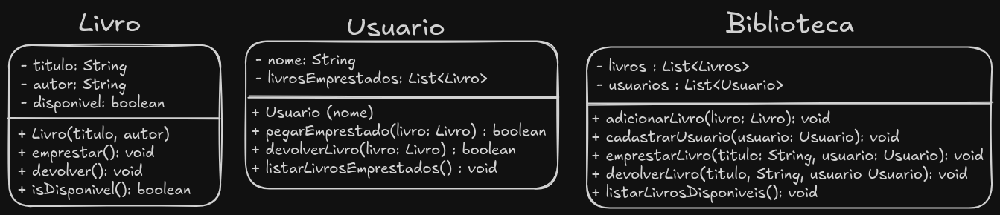

# 📚 Sistema de Biblioteca com Empréstimos e Devoluções

## 📝 Descrição
Este exercício propõe a implementação de um sistema de gerenciamento de uma biblioteca utilizando **Programação Orientada a Objetos (POO)** em **Java**. O objetivo é consolidar conceitos como **encapsulamento, relacionamento entre classes, manipulação de listas** e **controle de estado**.

## 🎯 Objetivo
Os alunos devem criar um sistema onde livros podem ser cadastrados, emprestados e devolvidos por usuários. Além disso, a biblioteca deve ser capaz de listar livros disponíveis e gerenciar empréstimos de forma eficiente.

## 📌 Requisitos

### **1. Classe `Livro`**
Representa um livro da biblioteca.
- **Atributos**:
    - `titulo` (String) → Nome do livro.
    - `autor` (String) → Nome do autor.
    - `disponivel` (boolean) → Indica se o livro está disponível para empréstimo.
- **Métodos**:
    - `Livro(String titulo, String autor)`: Construtor para inicializar um livro como disponível.
    - `emprestar()`: Marca o livro como indisponível.
    - `devolver()`: Marca o livro como disponível novamente.
    - `isDisponivel()`: Retorna `true` se o livro estiver disponível, caso contrário, `false`.

---

### **2. Classe `Usuario`**
Representa um usuário da biblioteca.
- **Atributos**:
    - `nome` (String) → Nome do usuário.
    - `livrosEmprestados` (Lista de Livros) → Armazena os livros emprestados pelo usuário.
- **Métodos**:
    - `Usuario(String nome)`: Construtor para inicializar um usuário.
    - `pegarEmprestado(Livro livro)`: Adiciona um livro à lista de livros emprestados, se estiver disponível.
    - `devolverLivro(Livro livro)`: Remove um livro da lista de livros emprestados.
    - `listarLivrosEmprestados()`: Exibe os livros que o usuário pegou emprestado.

---

### **3. Classe `Biblioteca`**
Gerencia os livros e usuários da biblioteca.
- **Atributos**:
    - `livros` (Lista de Livros) → Armazena todos os livros cadastrados.
    - `usuarios` (Lista de Usuários) → Armazena os usuários cadastrados.
- **Métodos**:
    - `adicionarLivro(Livro livro)`: Adiciona um livro à biblioteca.
    - `cadastrarUsuario(Usuario usuario)`: Cadastra um usuário na biblioteca.
    - `emprestarLivro(String titulo, Usuario usuario)`: Permite que um usuário pegue um livro emprestado, se disponível.
    - `devolverLivro(String titulo, Usuario usuario)`: Permite que um usuário devolva um livro.
    - `listarLivrosDisponiveis()`: Exibe apenas os livros que estão disponíveis.

---

## 🚀 Desafio Extra
Para alunos que desejam aprofundar mais no exercício, implemente as seguintes melhorias:
- Criar uma classe `LivroDigital` e `LivroFisico`, estendendo `Livro` e adicionando atributos específicos.
- Criar um **sistema de penalidades**, onde um usuário que não devolve um livro por um período definido **não pode pegar novos livros**.
- Implementar um **menu interativo no console** para que o usuário possa escolher opções como "Emprestar um livro" ou "Devolver um livro".

---

## 🏁 Como Começar?
1. **Crie um novo projeto Java** e adicione as classes mencionadas acima.
2. **Implemente os métodos conforme os requisitos**.
3. **No método `main()`**, simule um fluxo de uso da biblioteca:
    - Cadastre livros e usuários.
    - Empreste e devolva livros.
    - Liste os livros disponíveis antes e depois dos empréstimos.
4. **Teste todas as funcionalidades** para garantir que o sistema funcione corretamente.

---

## 🎓 Benefícios deste Exercício
✅ Reforça conceitos de **Encapsulamento, Associações e Listas**.  
✅ Exercita **Manipulação de Objetos e Estruturas de Dados**.  
✅ Simula um **sistema real**, incentivando a criatividade dos alunos.

---

### **📌 Agora é com você!**
Implemente o sistema, teste diferentes cenários e, se possível, faça melhorias! 🚀  
